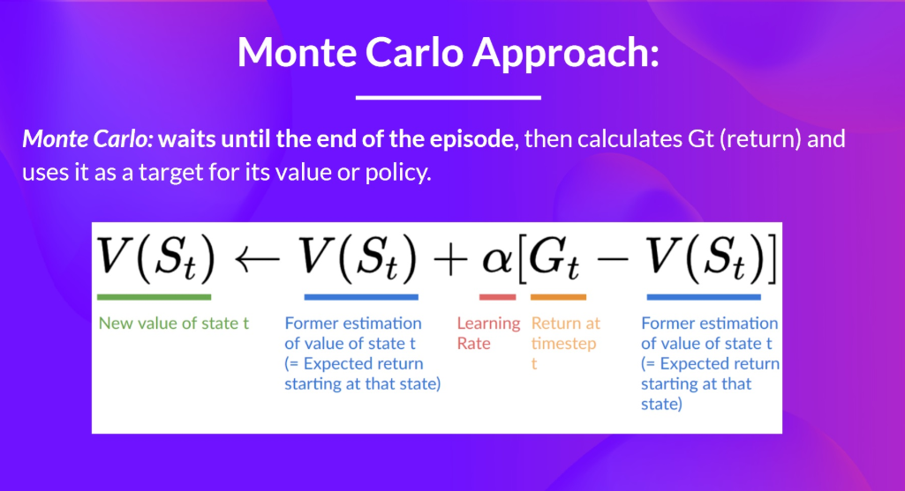
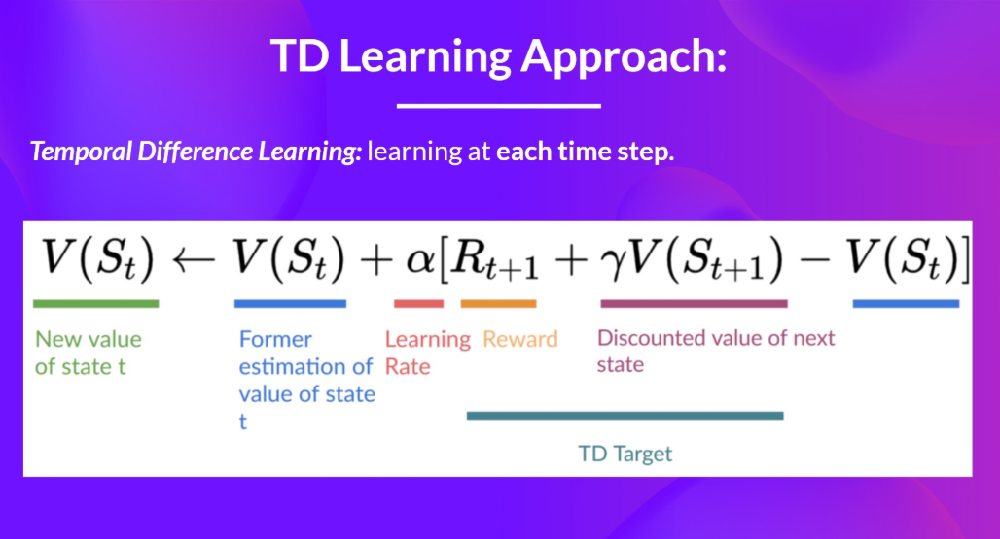
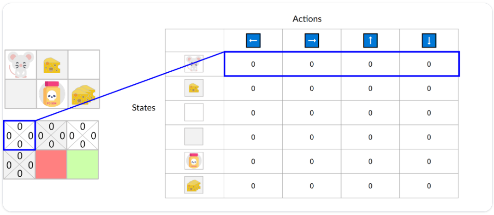
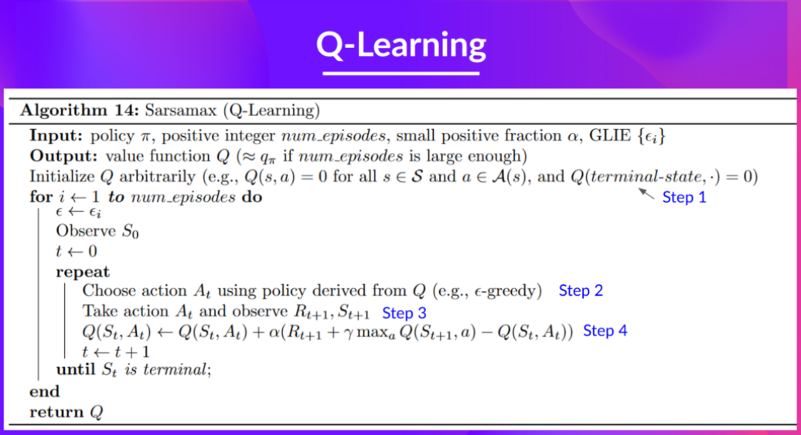
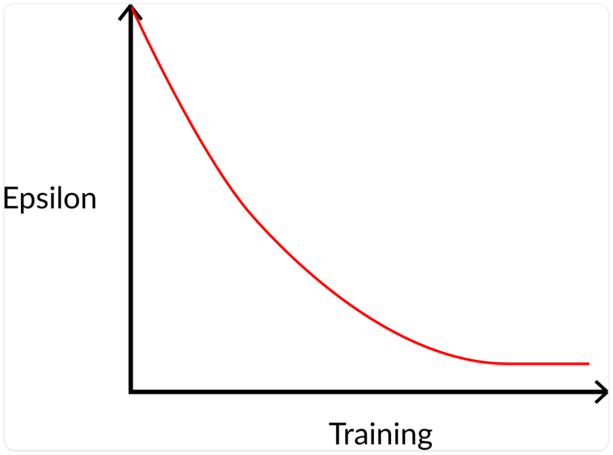
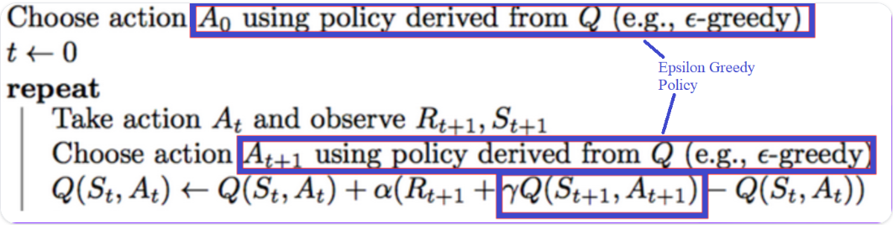

# Q-Learning

## 1. Prerequisites

### 1.1 Value-based methods and Policy-based methods

**value-based** methods compute the expected discounted rewards corresponding to a given state via a value function (value-function).

By finding the optimal value function $Q^*$ or $V^*$, we are in fact indirectly finding an optimal policy $\pi^*$. The meaning of the formula here is: given a state–action pair $(s,a)$, each time we choose the action $a$ that, according to the value function, leads to the state with the largest value.

**policy-based** methods directly train an optimal policy $\pi^*$, so that given a state $s$ as input, the policy outputs the action $a$ we should take.

> **We can notice a problem: whether it is a value-based method or a policy-based method, both require a policy $\pi$. One finds the optimal policy directly, while the other finds the optimal value function first and then indirectly obtains the optimal policy $\pi$.**

### 1.2 Exploration/Exploitation

**exploration** means the **agent** will try some new actions that it has never executed in its past experience, in order to explore a new environment. This behavior can help the **agent** discover larger rewards, but it also means taking on a certain amount of risk.

**exploitation** means the **agent** executes familiar actions based on existing experience—actions that are believed to quickly bring **reward**. However, doing so may miss the possibility of exploring new environments, and the efficiency may be lower than the former.

> In practice, during training we need to make a **trade-off** between the two. We should not be stubbornly biased to one side; instead, we must weigh them flexibly to obtain the optimal result.

## 2. Two **value-based** functions

### 2.1 The state-value function (State-value function)

First, let's look at the formula of the state-value function:

Here, **$V_\pi(s)$** represents the value when starting from state $s$ and continuing to follow policy $\pi$ thereafter. This value is an expectation.

### 2.2 The action-value function (Action-value function)

The formula of the action-value function is a bit different:

Unlike the state-value function, the action-value function is not the value of a state $s$, but the value of a $(s,a)$ state–action pair. That is, in a state $s$, if we take an action $a$, what is the corresponding value? Likewise, this value is an expectation.

> After comparing the two, we can see that **state value function** computes the value corresponding to a state, while **action value function** computes the value corresponding to a state–action pair. This is the difference, and the similarity is that both of their values are expectations.
> 
> Also note that if we implement these two methods in the straightforward way—i.e., filling in every state with the value it should have—this would mean we need to start from every state and ... which is extremely time-consuming and unrealistic. At this point, there is a very useful mathematical tool to help us handle this problem — the **bellman equation**.

## 3. The Bellman Equation

Since the calculation of total reward for a concrete state in entire episode is hard. We don't need to calculate a complete reward, in stead, we could use Bellman Equation.

The fomula is:

As we can see, we could replace the entire $G(t)$ with $R_{t+1}+\gamma*V_\pi(S_{t+1})$. So the update process is simplified: $V(S_t)=R_{t+1}+\gamma*V(S_{t+1})$.

## 4. Monte Carlo(MC) and Temporal Difference(TD) Learning

There are two learning strategies which help us learn an optimal value function or optimal policy.

### 4.1 Monte Carlo method

Here we take state value function as our value function.

Monte Carlo waits until the end of the episode, calculates $G(t)$ (return) and uses it as a target for updating $V(S_t)$. So it requires a complete episode of interaction before updating our value function.

By running more and more episodes, the agent will learn to play better and better. 

> Note: Monte Carlo method will calculate the cummulative reward through the **entire episode** $G(t)$. And then use it to update the status value.

### 4.2 Temporal Difference method

TD method is not as the same as MC method. It updates the state value instantly at every time step $t$. So it updates more frequently. Here is the formula:

> Note: When we are at state $S_t$ and take action $A_t$, we get reward $R_{t+1}$ and we are in the new state $S_{t+1}$. We use $R_{t+1}$ and the value of next state $V(S_{t+1})$ times $\gamma$ to do addition. Then, we use it as the target to update $V(S_t)$. 

### 4.3 Conclusion

With Monte Carlo, we update the value function from a complete episode, and so we use the actual accurate discounted return of this episode.

With TD Learning, we update the value function from a step, and we replace​ $G(t)$,which we don’t know, with an estimated return called the TD target.

I don't need to say much, here is the best conclusion I think...

## 5. Q-Learning

**Q-Learning** is a value-based method that is used to train the agent.

1. It is a value-based method.

2. It is off-policy method, which means it uses different method when in acting and updating. In a specific state we choose a specific action, we usually use $\epsilon$-greedy policy, while we usually use greedy policy when we update the current state value.

3. It uses TD learning strategy to train the value function.

**Q-Learning** uses a table called **Q-table** to store the state-action value. Like this:

The **Q-Learning** algorithm is as follows:

> 1. First, we initialize the **Q-table**, usually initialize them as 0.
> 
> 2. Second, at the current state, we use $\epsilon$-greedy policy (or other policies) to choose an action.
> 
> 3. Three, we use the TD strategy to update the current state-action value. This time we use greedy policy to choose an action for the next state. (So called off-policy pattern).

**Note:** What is $\epsilon$-greedy policy ? That means we choose to explore in a probability $\epsilon$, and we choose to exploit in a probability $1-\epsilon$. From the beginning of the training process, the $\epsilon$ is relatively big because we need to explore (make some random actions). As the training continues, the value of $\epsilon$ is smaller and smaller, means the agent needs to exploit more than explore.

**Extra:** **Sarsa** algorithm, which is quite simillar to **Q-Learning**, is a little different. It is an *on-policy* algorithm, so it uses the same policy to choose action when it is in acting process and when it is in updating process.

Let's compare the difference between on-policy and off-policy algorithm.

